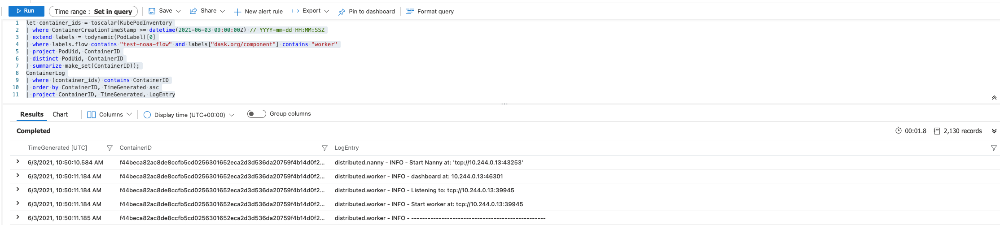

# pangeo-forge Azure Bakery ☁️🍞

This repository serves as the provider of an Terraform Application which deploys the necessary infrastructure to provide a `pangeo-forge` Bakery on Azure

# Contents

* [🧑‍💻 Development - Requirements](#requirements)
* [🧑‍💻 Development - Getting Started](#getting-started-🏃‍♀️)
* [🧑‍💻 Development - Makefile goodness](#makefile-goodness)
* [🚀 Deployment - Prerequisites](#prerequisites)
* [🚀 Deployment - Deploying](#deploying)
* [🚀 Deployment - Destroying](#destroying)
* [📊 Flows - Registering the test Recipe](#registering-the-test-recipe)
* [📊 Flows - Logging](#logging)

# Development

## Requirements

To develop on this project, you should have the following installed:

* [Python 3.8.*](https://www.python.org/downloads/) (We recommend using [Pyenv](https://github.com/pyenv/pyenv) to handle Python versions)
* [Poetry](https://github.com/python-poetry/poetry)
* [Azure CLI](https://docs.microsoft.com/en-us/cli/azure/install-azure-cli)
* [kubectl](https://kubernetes.io/docs/tasks/tools/#kubectl)
* [Terraform 0.15.1](https://www.terraform.io/downloads.html)
* [Docker](https://docs.docker.com/get-docker/)

If you're developing on MacOS, all of the above can be installed using [homebrew](https://brew.sh/)

If you're developing on Windows, we'd recommend using either [Git BASH](https://gitforwindows.org/) or [Windows Subsystem for Linux](https://docs.microsoft.com/en-us/windows/wsl/install-win10)


## Getting Started 🏃‍♀️

_**NOTE:** All `make` commands should be run from the **root** of the repository_

### Installing dependencies

This project requires some Python dependencies (Namely `prefect` and `dotenv`), these are so that:

* We can register flows for testing (it was also used to generate `prefect_agent_conf.yaml`)
* We can use `.env` files to provide both Prefect Flows and Terraform environment variables

To install the dependencies, run:

```bash
$ make install # Runs `poetry install` to install all Python dependencies required
```

### Azure Credential setup

To develop and deploy this project, you will first need to setup some credentials and permissions on Azure

#### Logging in

With the Azure CLI installed, run:

```bash
$ az login # Opens up a browser window to login with
[
  {
    "cloudName": "AzureCloud",
    "homeTenantId": "<a-home-tenant-id>",
    "id": "<a-id>",
    "isDefault": true,
    "managedByTenants": [],
    "name": "SuperAwesomeSubscription",
    "state": "Enabled",
    "tenantId": "<a-tenant-id>",
    "user": {
      "name": "<your-username>",
      "type": "user"
    }
  },
  ...
]
```

If you notice that the `Subscription` you intend to use has `"isDefault": false`, then refer to [this documentation](https://docs.microsoft.com/en-us/cli/azure/manage-azure-subscriptions-azure-cli#change-the-active-subscription) on how to switch your default `Subsciption`.

#### Getting your Subscription ID

You will need to get the ID for the Subscription that is set to `"isDefault": true`, you can do this with:

```bash
$ az account list -o table
Name                CloudName    SubscriptionId                        State    IsDefault
------------------  -----------  ------------------------------------  -------  -----------
sub-0               AzureCloud   <an-id>                               Enabled  False
sub-1               AzureCloud   <an-id>                               Enabled  True
sub-2               AzureCloud   <an-id>                               Enabled  False
```

Take note of the `SubscriptionId` value.

#### Creating a Service Principal

You will then need to create a `Service Principal` to deploy as:

```bash
$ az ad sp create-for-rbac --name "<name-for-your-service-principal>"
{
  "appId": "<an-app-id>",
  "displayName": "<name-for-your-service-principal>",
  "name": "http://<name-for-your-service-principal>",
  "password": "<a-password>",
  "tenant": "<a-tenant-id>"
}
```

Take note of the values of `appId`, `password`, and `tenant`.

#### Adding Service Principal permissions

Your service principal will need a few permissions added to it, for these you'll need to get its `objectId`, you can get this by running:

```bash
$ az ad sp list --display-name "pangeo-forge-sp" --query="[].objectId" -o tsv
<objectId>
```

You can then use that `objectId` to run:

```bash
$ az role assignment create --assignee "<objectId>" --role "Storage Blob Data Contributor"
$ az role assignment create --assignee "<objectId>" --role "User Access Administrator"
$ az role assignment create --assignee "<objectId>" --role  "Azure Kubernetes Service Cluster User Role"
```

You should now be setup with the correct permissions to deploy the infrastructure onto Azure. Further reading on Azure Service Principals can be found [here](https://docs.microsoft.com/en-us/cli/azure/ad/sp?view=azure-cli-latest).

### `.env` file

A `.env` file is expected at the root of the repository to store variables used within deployment, the expected variables are:

```bash
# SET BY YOU MANUALLY:

ARM_SUBSCRIPTION_ID="<your-subscription-id>" # See [Development > Getting Started > Azure Credential setup > Getting your Subscription ID]
ARM_TENANT_ID="<your-service-principals-tenant-id>" # See [Development > Getting Started > Azure Credential setup > Creating a Service Principal]
ARM_CLIENT_ID="<your-service-principals-app-id>" # See [Development > Getting Started > Azure Credential setup > Creating a Service Principal]
ARM_CLIENT_SECRET="<your-service-principals-password>" # See [Development > Getting Started > Azure Credential setup > Creating a Service Principal]

TF_VAR_owner="<your-name>"
TF_VAR_identifier="<a-unique-value-to-tie-to-your-deployment>" # Try to keep this short (Less than 10 chars and only a-z A-Z 0-9 symbols)
TF_VAR_region="<azure-region-name-to-deploy-to>"
BAKERY_NAMESPACE="<the-name-for-your-prefect-agent-k8s-configs-namespace>"
BAKERY_IMAGE="<pangeo-forge-bakery-images-image-you-wish-to-use>" # See [Deployment > Prerequisites > Bakery Image]
PREFECT__CLOUD__AGENT__AUTH_TOKEN="<value-of-runner-token>" # See https://docs.prefect.io/orchestration/agents/overview.html#tokens - This is required for your Agent to communicate to Prefect Cloud
PREFECT__CLOUD__AUTH_TOKEN="<value-of-tenant-token>" # See https://docs.prefect.io/orchestration/concepts/tokens.html#tenant - This is used to support flow registration
PREFECT_PROJECT="<name-of-a-prefect-project>" # See https://docs.prefect.io/orchestration/concepts/projects.html#creating-a-project - This is where the bakery's test flows will be registered
PREFECT__CLOUD__AGENT__LABELS="<a-set-of-prefect-agent-labels>" # See https://docs.prefect.io/orchestration/agents/overview.html#labels - These will be registered with the deployed agent to limit which flows should be executed by the agent

# AUTOMATICALLY INSERTED/UPDATED BY MAKE COMMANDS:

TF_CLI_ARGS_init="<backend-config-values>" # See [Deployment - Prerequisites > Terraform Remote State infrastructure]
FLOW_STORAGE_CONTAINER="<a-flow-storage-container-name>" # See [Deployment - Standard Deployments > Retrieving Flow Storage Container names and Storage Connection String]
FLOW_CACHE_CONTAINER="<a-flow-storage-container-name>" # See [Deployment - Standard Deployments > Retrieving Flow Storage Container names and Storage Connection String]
FLOW_STORAGE_CONNECTION_STRING="<a-storage-account-connection-string>" # See [Deployment - Standard Deployments > Retrieving Flow Storage Container name and Storage Connection String]
```

An example called `example.env` is available for you to copy, rename, and fill out accordingly.

## Makefile goodness

A `Makefile` is available in the root of the repository to abstract away commonly used commands for development:

**`make install`**

> This will run `poetry install` with the contents of `poetry.lock`

**`make setup-remote-state`**

> This will run `setup_remote_state.sh` with the contents of `.env`, it uses Azure CLI to provision a Resource Group, Storage Account, and Storage container for the Remote State that Terraform will use

**`make destroy-remote-state`**

> This will use Azure CLI to destroy the Remote State infrastructure provisioned via `make setup-remote-state`. The command assumes that the Resource Group is named as defined in the `setup_remote_state.sh` script: `<identifier>-bakery-remote-state-resource-group`

**`make init`**

> This will run `terraform init` within the `terraform/` directory, installing any providers required for deployment. You **must** have run `make setup-remote-state` beforehand

**`make lint-init`**

> This will run `terraform init -backend=false` within the `terraform/` directory, installing any providers required for terraform to run `validate`. You **must** have run `make setup-remote-state` beforehand

**`make lint`**

> This will run `terraform validate` within the `terraform/` directory, showing you anything that is incorrect in your Terraform scripts. It also runs isort, black, and flake8 to highlight any linting issues in `flow_test/` and `scripts/`

**`make format`**

> This will run `terraform fmt` within the `terraform/` directory. It also runs isort and black in `flow_test/` and `scripts/`. This **will** modify files if issues were found

**`make plan`**

> This will run `terraform plan` within the `terraform/` directory using the contents of your `.env` file. You **must** have run `make setup-remote-state` beforehand

**`make apply`**

> This will run `terraform apply` within the `terraform/` directory using the contents of your `.env` file. The deployment is auto-approved, so **make sure** you know what you're changing with your deployment first! (Best to run `make plan` to check!). You **must** have run `make setup-remote-state` beforehand

**`make destroy`**

> This will run `terraform destroy` within the `terraform/` directory using the contents of your `.env` file. The destroy is auto-approved, so **make sure** you know what you're destroying first! You **must** have run `make setup-remote-state` beforehand

**`make configure-kubectl`**

> This will setup `kubectl` to point to your deployed AKS cluster using the output variables terraform creates. You **must** have deployed the cluster first

**`make setup-agent`**

> This will create a namespace on the AKS cluster with the name of `BAKERY_NAMESPACE`, then the agent configuration in `prefect_agent_conf.yaml` will be applied to the cluster. You **must** have deployed the cluster first

**`make retrieve-flow-storage-values`**

> This will use Terraform and Azure CLI to populate `.env` with the values of `FLOW_STORAGE_CONTAINER`, `FLOW_CACHE_CONTAINER`, and `FLOW_STORAGE_CONNECTION_STRING` so that you can register Flows. You **must** have deployed the cluster first

**`make build-and-push-image`**

> This will use Docker and Azure CLI to build and push the image defined in [Deployment -> Pushing the Prefect Agent/Worker image] to ACR. You **must** have deployed the cluster first

**`make deploy-bakery`**

> This encapsulates all the infrastructure and `.env` setup steps needed to deploy the Azure Bakery. This command is the same as running: `make setup-remote-state apply build-and-push-image configure-kubectl setup-agent retrieve-flow-storage-values`.

**`make register-flow`**

> This uses the bakery image defined in `BAKERY_IMAGE` to register your Flow with Prefect. It takes a parameter `flow` which is the Python file within `flow_test/` you'd like to use. You would use it like: `$ make register-flow flow=oisst_recipe.py`

# Deployment

## Prerequisites

### Authentication and Dependencies
Before you deploy the infrastructure, ensure you've taken all the steps outlined under [Azure Credential setup](#azure-credential-setup) and have run [`make install`](#makefile-goodness)

### Terraform Remote State infrastructure

The Terraform deployment relies on [Remote State](https://docs.microsoft.com/en-us/azure/developer/terraform/store-state-in-azure-storage) within Azure, this is so that the state of your deployment is not locked to a file on your local machine.

> The concept of Remote State becomes a 🐓 and 🥚 situation where you need infrastructure available for Terraform to store your state, but you don't want to use Terraform for that infrastructure as that then needs remote state...

The process of provisioning the infrastructure to support Remote State is encapsulated in a bash script: `setup_remote_state.sh`. To provision your Remote State infrastructure, run:

```bash
$ make setup-remote-state # Creates the infrastructure to host your Terraform Remote State
<various-azure-cli-ouput>

Found TF_CLI_ARGS_init set in `.env`, replaced with: TF_CLI_ARGS_init="-backend-config='resource_group_name=<identifier>-bakery-remote-state-resource-group' -backend-config='storage_account_name=remotestatestoreacc' -backend-config='container_name=<identifier>-bakery-remote-state-storage-container' -backend-config='access_key=<an-access-key>' -backend-config='key=<identifier>-bakery.state'"
```

### Bakery Image

To be able to register and run Recipes as Prefect Flows, your Bakery must be running one of the `pangeo-forge-bakery-images` images in both your Prefect Agent **and** your Flow & Dask tasks.

You can find more information on the `pangeo-forge-bakery-images` [here](https://github.com/pangeo-forge/pangeo-forge-bakery-images). Once you've selected which tag you wish to support, you need to add an entry into `.env` under the name `BAKERY_IMAGE`. See below for an example:

```bash
BAKERY_IMAGE="pangeo/pangeo-forge-bakery-images:pangeonotebook-2021.05.15_prefect-0.14.19_pangeoforgerecipes-0.3.4"
```

## Deploying

A Standard Deployment of the Azure Bakery comprises of several steps, they are listed below; the links will take you to an explanation of each step.

Should you wish to just deploy the Bakery without diving into these steps, ensure you've met all of the [prerequisites](#prerequisites) for deployment, then you can simply run:

```bash
$ make deploy-bakery # Deploys all the Azure Bakery infrastructure and prepares `.env` for further usage
```

**Deployment steps**

0. [Ensure you've done the pre-requisites](#prerequisites)
1. [Confirm what's being deployed via Terraform](#confirm-what's-being-deployed-via-terraform)
2. [Deploying AKS via Terraform](#deploying-aks-via-terraform)
3. [Pushing the Prefect Agent/Worker image](#pushing-the-prefect-agent/worker-image)
4. [Setting up the Prefect Agent](#setting-up-the-prefect-agent)
5. [Retrieving Flow Storage Container names and Storage Connection String](#retrieving-flow-storage-container-names-and-storage-connection-string)

### Confirm what's being deployed via Terraform

You can check _what_ you'll be deploying by running:

```bash
$ make plan # Outputs the result of `terraform plan`
```

### Deploying AKS via Terraform

To deploy the Azure infrastructure required to host your Bakery, you can run:

```bash
$ make apply # Deploys the Bakery AKS Cluster and storage
```

### Setting up the Prefect Agent

To setup the Prefect Agent for your Bakery within your AKS cluster, you can run:

```bash
$ make configure-kubectl # Uses the output from Terraform to configure kubectl to point to the newly deployed cluster
$ make setup-agent # This will create a namespace on the AKS cluster with the name of `BAKERY_NAMESPACE`, then the agent configuration in `prefect_agent_conf.yaml` will be applied to the cluster, registering itself as an Agent for the Prefect Project defined in `PREFECT_PROJECT`, using `PREFECT__CLOUD__AGENT__AUTH_TOKEN` to authenticate
```

### Retrieving Flow Storage Container names and Storage Connection String

To successfully register and store your flow, you will need to retrieve the Container name and Connection string, you can run the following to populate the values of `FLOW_STORAGE_CONTAINER`, `FLOW_CACHE_CONTAINER`, and `FLOW_STORAGE_CONNECTION_STRING`:

```bash
$ make retrieve-flow-storage-values
Didnt find FLOW_STORAGE_CONTAINER set in `.env`, set to: FLOW_STORAGE_CONTAINER="<identifier>-bakery-flow-storage-container"
Didnt find FLOW_CACHE_CONTAINER set in `.env`, set to: FLOW_CACHE_CONTAINER="<identifier>-bakery-flow-cache-container"
Didnt find FLOW_STORAGE_CONNECTION_STRING set in `.env`, set to: FLOW_STORAGE_CONNECTION_STRING="<connection-string>"
```

## Destroying

**Destroying steps**

Removal of the Bakery comprises of two steps, they are listed below and further explained as you scroll down:

1. [Destroying all Bakery Azure infrastructure](#destroying-all-bakery-azure-infrastructure)
2. [Destroying the Remote State infrastructure](#destroying-the-remote-state-infrastructure)

### Destroying all Bakery Azure infrastructure

To destroy the Bakery infrastructure within Azure, you can run:

```bash
$ make destroy # Destroys the Bakery infrastructure - ** NOT the Remote State infrastructure **
```

### Destroying the Remote State infrastructure

As the Remote State infrastructure is not provisioned with Terraform, we have to delete it manually with the Azure CLI.

**You only need to delete this infrastructure if you're no longer deploying a Bakery; if you're destroying and re-deploying your Bakery frequently, don't delete this infrastructure**

To delete the Remote State infrastructure, run:

```bash
$ make destroy-remote-state # Uses Azure CLI to destroy the Remote State infrastructure
```

# Flows

## Registering the test Recipe

For quick testing of your Bakery deployment, there's a Recipe setup as a Flow within `flow_test/` that you can register and run. Before you register the example Flow, you must have the values of `PREFECT__CLOUD__AUTH_TOKEN`, `PREFECT_PROJECT`, `PREFECT__CLOUD__AGENT__LABELS`, `FLOW_STORAGE_CONTAINER`, `FLOW_CACHE_CONTAINER`, `FLOW_STORAGE_CONNECTION_STRING`, and `BAKERY_IMAGE` present and populated in `.env`. You must also have run [`make install`](#makefile-goodness).

When your `.env` is populated and you've installed the project dependencies, you can register the Flow by running:

```
$ make register-flow flow=<name-of-flow-file-in-flow_test/>.py
...
[2021-04-29 13:28:22+0100] INFO - prefect.Azure | Uploading test-noaa-flow/2021-06-03t10-07-21-944813-00-00 to <identifier>-bakery-flow-storage-container
Flow URL: https://cloud.prefect.io/<your-account>/flow/aef82344-8a31-485b-a189-bc1398755f9e
 └── ID: ca02500f-97ea-4605-9f66-1cccb457a3c0
 └── Project: <PREFECT_PROJECT>
 └── Labels: <PREFECT__CLOUD__AGENT__LABELS>
```

You can then navigate to [cloud.prefect.io](https://cloud.prefect.io/), find your Flow, and run it.

## Logging

The deployment sets up a `Log Analytics Workspace` which AKS then references when we setup an `oms_agent` (Operations Management Suite) addon for the Bakery cluster. This enables us to have long-lived logging for the Kubernetes pods so that we can keep track of Flow runs for debugging.

### Prefect Flow Runner Logs

Currently, the easiest way I've found to get hold of the logs for the Flow you've just run goes as follows:

1. Find the Flow location of your Flow in the Prefect UI:


2. Navigate to your Bakery Cluster Logs in the Azure Portal:


3. Query for the `ContainerID` of the pod that ran your flow:
    ```
    ContainerLog
    | where LogEntry contains "<flow-location>"
    | project ContainerID
    ```
    

4. Query for the logs for that `ContainerID`, to get the full flow logs:
    ```
    ContainerLog
    | where ContainerID in ("<containerid>")
    | project TimeGenerated, LogEntry
    ```
    

The default behaviour of AKS is to only display live logs for Pods, hence the need to deploy the `Log Analytics Workspace`. The default Kubernetes behaviour for a Succeeded Pod is to delete that Pod, so we have to query for the `ContainerID` of the Pod that ran our specific flow as there's no other means of retrieving it within the Azure Portal.

### Prefect Flow Dask Worker Logs

The easiest way I've found so far to get hold of the logs for Dask, for the Flow you've just run goes as follows:

1. Navigate to your Bakery Cluster Logs in the Azure Portal:


2. Run the following query, filling out the required sections:
    ```
    let container_ids = toscalar(KubePodInventory
    | where ContainerCreationTimeStamp >= datetime("<utc-timestamp-of-just-before-you-ran-your-flow>") // e.g "2021-01-20 10:03:12Z"
    | extend labels = todynamic(PodLabel)[0]
    | where labels.flow contains "<flow-name>" and labels["dask.org/component"] contains "worker"
    | project PodUid, ContainerID
    | distinct PodUid, ContainerID
    | summarize make_set(ContainerID));
    ContainerLog
    | where (container_ids) contains ContainerID
    | order by ContainerID, TimeGenerated asc
    | project ContainerID, TimeGenerated, LogEntry

    // This query does the following:
    // 1. Queries KubePodInventory for Pods with Container Creation times equal to or after your specified datetime
    // 2. Extends the results to include the Pod labels
    // 3. Filters on whether the Pod has the labels `flow=<flow-name>` and `dask.org/component="worker"`
    // 4. Collects all the ContainerIDs into a list
    // 5. Assigns this list to the variable `container_ids`
    // 6. Queries ContainerLog for all logs where the Container ID is in `container_ids`
    ```
    
