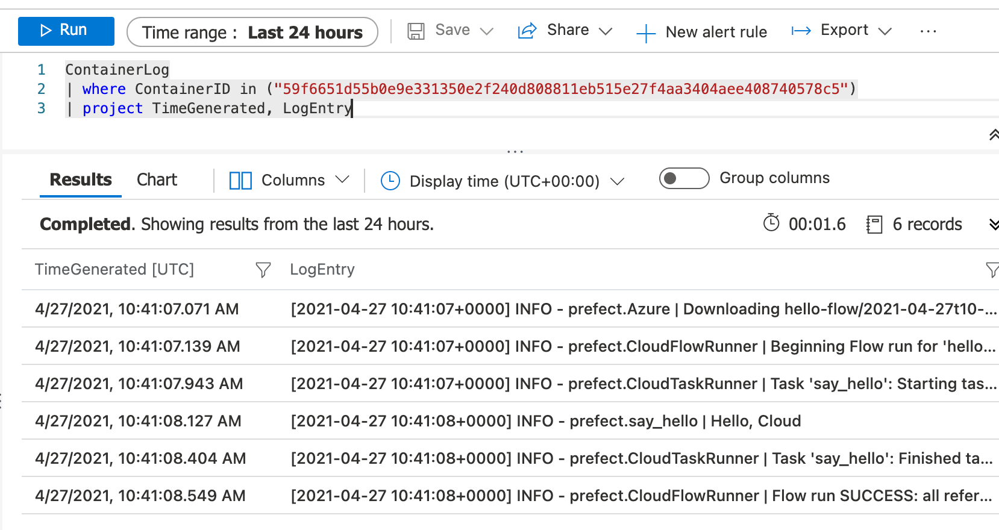

# pangeo-forge Azure Bakery ☁️🍞

This repository serves as the provider of an Terraform Application which deploys the necessary infrastructure to provide a `pangeo-forge` Bakery on Azure

# Contents

* [🧑‍💻 Development - Requirements](#requirements)
* [🧑‍💻 Development - Getting Started](#getting-started-🏃‍♀️)
* [🧑‍💻 Development - Makefile goodness](#makefile-goodness)
* [🚀 Deployment - Prerequisites](#prerequisites)
* [🚀 Deployment - Standard Deployments](#standard-deployments)
* [📊 Flows - Logging](#logging)

# Development

## Requirements

To develop on this project, you should have the following installed:

* [Python 3.8.*](https://www.python.org/downloads/) (We recommend using [Pyenv](https://github.com/pyenv/pyenv) to handle Python versions)
* [Poetry](https://github.com/python-poetry/poetry)
* [Azure CLI](https://docs.microsoft.com/en-us/cli/azure/install-azure-cli)
* [kubectl](https://kubernetes.io/docs/tasks/tools/#kubectl)
* [Terraform 0.15.0](https://www.terraform.io/downloads.html)

If you're developing on MacOS, all of the above can be installed using [homebrew](https://brew.sh/)

If you're developing on Windows, we'd recommend using either [Git BASH](https://gitforwindows.org/) or [Windows Subsystem for Linux](https://docs.microsoft.com/en-us/windows/wsl/install-win10)


## Getting Started 🏃‍♀️

### Installing dependencies

This project requires some Python dependencies (Namely `prefect` and `dotenv`), these are so that:

* We can register flows for testing (it was also used to generate `prefect_agent_conf.yaml`)
* We can use `.env` files to provide both Prefect Flows and Terraform environment variables

To install the dependencies, run:

```bash
$ make install # Runs `poetry install` to install all Python dependencies required
```

### Azure Credential setup

To develop and deploy this project, you will first need to setup some credentials and permissions on Azure

#### Logging in

With the Azure CLI installed, run:

```bash
$ az login # Opens up a browser window to login with
[
  {
    "cloudName": "AzureCloud",
    "homeTenantId": "<a-home-tenant-id>",
    "id": "<a-id>",
    "isDefault": true,
    "managedByTenants": [],
    "name": "SuperAwesomeSubscription",
    "state": "Enabled",
    "tenantId": "<a-tenant-id>",
    "user": {
      "name": "<your-username>",
      "type": "user"
    }
  },
  ...
]
```

If you notice that the `Subscription` you intend to use has `"isDefault": false`, then refer to [this documentation](https://docs.microsoft.com/en-us/cli/azure/manage-azure-subscriptions-azure-cli#change-the-active-subscription) on how to switch your default `Subsciption`.

#### Creating a Service Principal

You will then need to create a `Service Principal` to deploy as:

```bash
$ az ad sp create-for-rbac --name "<name-for-your-service-principal>"
{
  "appId": "<an-app-id>",
  "displayName": "<name-for-your-service-principal>",
  "name": "http://<name-for-your-service-principal>",
  "password": "<a-password>",
  "tenant": "<a-tenant-id>"
}
```

#### Adding Service Principal permissions

Your service principal will need a few permissions added to it, for these you'll need to get its `objectId`, you can get this by running:

```bash
$ az ad sp list --display-name "<name-for-your-service-principal>"
[
  {
    "accountEnabled": "True",
    "addIns": [],
    "alternativeNames": [],
    "appDisplayName": "<name-for-your-service-principal>",
    "appId": "<a-app-id>",
    "appOwnerTenantId": "<a-tenant-id>",
    "appRoleAssignmentRequired": false,
    "appRoles": [],
    "applicationTemplateId": null,
    "deletionTimestamp": null,
    "displayName": "<name-for-your-service-principal>",
    "errorUrl": null,
    "homepage": "https://<name-for-your-service-principal>",
    "informationalUrls": {
      "marketing": null,
      "privacy": null,
      "support": null,
      "termsOfService": null
    },
    "keyCredentials": [],
    "logoutUrl": null,
    "notificationEmailAddresses": [],
    "oauth2Permissions": [
      {
        "adminConsentDescription": "Allow the application to access <name-for-your-service-principal> on behalf of the signed-in user.",
        "adminConsentDisplayName": "Access <name-for-your-service-principal>",
        "id": "<an-id>",
        "isEnabled": true,
        "type": "User",
        "userConsentDescription": "Allow the application to access <name-for-your-service-principal> on your behalf.",
        "userConsentDisplayName": "Access <name-for-your-service-principal>",
        "value": "user_impersonation"
      }
    ],
    "objectId": "<a-object-id>",
    "objectType": "ServicePrincipal",
    "odata.type": "Microsoft.DirectoryServices.ServicePrincipal",
    "passwordCredentials": [],
    "preferredSingleSignOnMode": null,
    "preferredTokenSigningKeyEndDateTime": null,
    "preferredTokenSigningKeyThumbprint": null,
    "publisherName": "<a-publisher-name>",
    "replyUrls": [],
    "samlMetadataUrl": null,
    "samlSingleSignOnSettings": null,
    "servicePrincipalNames": [
      "http://<name-for-your-service-principal>",
      "<a-service-principal-id>"
    ],
    "servicePrincipalType": "Application",
    "signInAudience": "AzureADMyOrg",
    "tags": [],
    "tokenEncryptionKeyId": null
  }
]
```

From the resultant JSON output to the screen, copy the value of `objectID`.

You can then run:

```bash
$ az role assignment create --assignee "<objectId>" --role "Storage Blob Data Contributor"
$ az role assignment create --assignee "<objectId>" --role "User Access Administrator"
$ az role assignment create --assignee "<objectId>" --role  "Azure Kubernetes Service Cluster User Role"
```

You should now be setup with the correct permissions to deploy the infrastructure onto Azure. Further reading on Azure Service Principals can be found [here](https://docs.microsoft.com/en-us/cli/azure/ad/sp?view=azure-cli-latest).

### `.env` file

A `.env` file is expected at the root of the repository to store variables used within deployment, the expected variables are:

```bash
TF_VAR_owner="<your-name>"
TF_VAR_identifier="<a-unique-value-to-tie-to-your-deployment>"
TF_VAR_region="<azure-region-name-to-deploy-to>"
TF_CLI_ARGS_init="<backend-config-values>" # See [Deployment - Prerequisites > Terraform Remote State infrastructure]
BAKERY_NAMESPACE="<the-name-for-your-prefect-agent-k8s-configs-namespace>"
PREFECT__CLOUD__AGENT__AUTH_TOKEN="<value-of-runner-token>" # See https://docs.prefect.io/orchestration/agents/overview.html#tokens - This is required for your Agent to communicate to Prefect Cloud
PREFECT__CLOUD__AUTH_TOKEN="<value-of-tenant-token>" # See https://docs.prefect.io/orchestration/concepts/tokens.html#tenant - This is used to support flow registration
PREFECT_PROJECT="<name-of-a-prefect-project>" # See https://docs.prefect.io/orchestration/concepts/projects.html#creating-a-project - This is where the bakery's test flows will be registered
PREFECT__CLOUD__AGENT__LABELS="<a-set-of-prefect-agent-labels>" # See https://docs.prefect.io/orchestration/agents/overview.html#labels - These will be registered with the deployed agent to limit which flows should be executed by the agent
FLOW_STORAGE_CONTAINER="<a-flow-storage-container-name>" # See [Standard Deployments > Retrieving Flow Storage Container name and Storage Connection String]
FLOW_STORAGE_CONNECTION_STRING="<a-storage-account-connection-string>" # See [Standard Deployments > Retrieving Flow Storage Container name and Storage Connection String]
```

An example called `example.env` is available for you to copy, rename, and fill out accordingly.

## Makefile goodness

A `Makefile` is available in the root of the repository to abstract away commonly used commands for development:

**`make install`**

> This will run `poetry install` with the contents of `poetry.lock`

**`make setup-remote-state`**

> This will run `setup_remote_state.sh` with the contents of `.env`, it uses Azure CLI to provision a Resource Group, Storage Account, and Storage container for the Remote State that Terraform will use

**`make init`**

> This will run `terraform init` within the `terraform/` directory, installing any providers required for deployment. You **must** have run `make setup-remote-state` beforehand

**`make lint`**

> This will run `terraform validate` within the `terraform/` directory, showing you anything that is incorrect in your Terraform scripts. You **must** have run `make setup-remote-state` beforehand

**`make format`**

> This will run `terraform fmt` within the `terraform/` directory, this **will** modify files if issues were found

**`make plan`**

> This will run `terraform plan` within the `terraform/` directory using the contents of your `.env` file. You **must** have run `make setup-remote-state` beforehand

**`make apply`**

> This will run `terraform apply` within the `terraform/` directory using the contents of your `.env` file. The deployment is auto-approved, so **make sure** you know what you're changing with your deployment first! (Best to run `make plan` to check!). You **must** have run `make setup-remote-state` beforehand

**`make destroy`**

> This will run `terraform destroy` within the `terraform/` directory using the contents of your `.env` file. The destroy is auto-approved, so **make sure** you know what you're destroying first! You **must** have run `make setup-remote-state` beforehand

**`make configure-kubectl`**

> This will setup `kubectl` to point to your deployed AKS cluster using the output variables terraform creates. You **must** have deployed the cluster first

**`make setup-agent`**

> This will create a namespace on the AKS cluster with the name of `BAKERY_NAMESPACE`, then the agent configuration in `prefect_agent_conf.yaml` will be applied to the cluster. You **must** have deployed the cluster first

**`make retrieve-flow-storage-container`**

> This will use Terraform to echo out the value of the Bakeries Flow Storage Container name so that you can populate the value of `FLOW_STORAGE_CONTAINER` in `.env`. You **must** have deployed the cluster first

**`make retrieve-storage-connection-string`**

> This will use Terraform and Azure CLI to echo out the value of the Bakeries Flow Storage Accounts Connection String so that you can populate the value of `FLOW_STORAGE_CONNECTION_STRING` in `.env`. You **must** have deployed the cluster first

# Deployment

## Prerequisites

### Authentication and Dependencies
Before you deploy the infrastructure, ensure you've taken all the steps outlined under [Azure Credential setup](#azure-credential-setup) and have run [`make install`](#makefile-goodness)

### Terraform Remote State infrastructure

The Terraform deployment relies on [Remote State](https://docs.microsoft.com/en-us/azure/developer/terraform/store-state-in-azure-storage) within Azure, this is so that the state of your deployment is not locked to a file on your local machine.

> The concept of Remote State becomes a 🐓 and 🥚 situation where you need infrastructure available for Terraform to store your state, but you don't want to use Terraform for that infrastructure as that then needs remote state...

The process of provisioning the infrastructure to support Remote State is encapsulated in a bash script: `setup_remote_state.sh`. This script relies on environment variables within `.env`, so to provision your Remote State infrastructure, run:

```bash
$ make setup-remote-state # Creates the infrastructure to host your Terraform Remote State
<various-azure-cli-ouput>

Copy the following line into your .env file:

TF_CLI_ARGS_init="-backend-config='resource_group_name=<identifier>-bakery-remote-state-resource-group' -backend-config='storage_account_name=remotestatestoreacc' -backend-config='container_name=<identifier>-bakery-remote-state-storage-container' -backend-config='access_key=<an-access-key>' -backend-config='key=<identifier>-bakery.state'"
```

As the command output states, you should copy the whole `TF_CLI_ARGS_init=*` line into your `.env` file, this will tell Terraform in all further commands to use Remote State

## Standard Deployments

### Confirm what's being deployed via Terraform

You can check _what_ you'll be deploying by running:

```bash
$ make plan # Outputs the result of `terraform plan`
```

### Deploying AKS via Terraform

To deploy the Azure infrastructure required to host your Bakery, you can run:

```bash
$ make apply # Deploys the Bakery AKS Cluster and storage
```

### Setting up the Prefect Agent

To setup the Prefect Agent for your Bakery within your AKS cluster, you can run:

```bash
$ make configure-kubectl # Uses the output from Terraform to configure kubectl to point to the newly deployed cluster
$ make setup-agent # This will create a namespace on the AKS cluster with the name of `BAKERY_NAMESPACE`, then the agent configuration in `prefect_agent_conf.yaml` will be applied to the cluster
```

### Retrieving Flow Storage Container name and Storage Connection String

To successfully register and store your flow, you will need to populate `.env` with `FLOW_STORAGE_CONTAINER` and `FLOW_STORAGE_CONNECTION_STRING`

To retrieve the values so that you can update `.env`, run:

```bash
$ make retrieve-flow-storage-container
"a-storage-container-name" # Set this as FLOW_STORAGE_CONTAINER in `.env`
$ make retrieve-storage-connection-string
"a-connection-string" # Set this as FLOW_STORAGE_CONNECTION_STRING in `.env`
```

### Destroying all Azure infrastructure

To destroy the infrastructure within Azure, you can run:

```bash
$ make destroy # Destroys the Bakery
```

# Flows

## Registering Flows

For quick testing of your Bakery deployment, there are Flows within `flow_test/` that you can register and run. Before you register any of the example Flows, you must have the values of `PREFECT__CLOUD__AUTH_TOKEN`, `PREFECT_PROJECT`, `PREFECT__CLOUD__AGENT__LABELS`, `FLOW_STORAGE_CONTAINER`, and `FLOW_STORAGE_CONNECTION_STRING` present and populated in `.env`. You must also have run [`make install`](#makefile-goodness).

When your `.env` is populated and you've installed the project dependencies, you can register a Flow by running:

```
$ poetry run dotenv run python3 flow_test/<flow-file.py>

[2021-04-29 13:28:22+0100] INFO - prefect.Azure | Uploading hello-flow/2021-04-29t12-28-21-953051-00-00 to <identifier>-bakery-flow-storage-container
Flow URL: https://cloud.prefect.io/<your-account>/flow/aef82344-8a31-485b-a189-bc1398755f9e
 └── ID: ca02500f-97ea-4605-9f66-1cccb457a3c0
 └── Project: <PREFECT_PROJECT>
 └── Labels: <PREFECT__CLOUD__AGENT__LABELS>
```

You can then navigate to [cloud.prefect.io](https://cloud.prefect.io/), find your Flow, and run it.

## Logging

The deployment sets up a `Log Analytics Workspace` which AKS then references when we setup an `oms_agent` (Operations Management Suite) addon for the Bakery cluster. This enables us to have long-lived logging for the Kubernetes pods so that we can keep track of Flow runs for debugging.

Currently, the easiest way I've found to get hold of the logs for the Flow you've just run goes as follows:

1. Find the Flow location of your Flow in the Prefect UI:


2. Navigate to your Bakery Cluster Logs in the Azure Portal:


3. Query for the `ContainerID` of the pod that ran your flow:
    ```
    ContainerLog
    | where LogEntry contains "<flow-location>"
    | project ContainerID
    ```
    

4. Query for the logs for that `ContainerID`, to get the full flow logs:
    ```
    ContainerLog
    | where ContainerID in ("<containerid>")
    | project TimeGenerated, LogEntry
    ```
    

The default behaviour of AKS is to only display live logs for Pods, hence the need to deploy the `Log Analytics Workspace`. The default Kubernetes behaviour for a Succeeded Pod is to delete that Pod, so we have to query for the `ContainerID` of the Pod that ran our specific flow as there's no other means of retrieving it within the Azure Portal.
